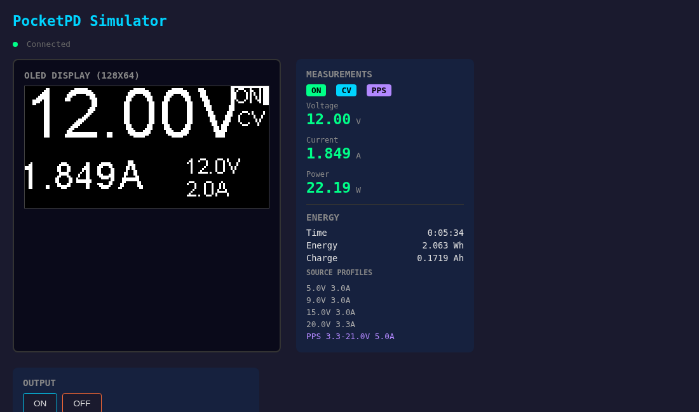

# MicroPython PocketPD

A MicroPython port of the [PocketPD](https://github.com/CentyLab/PocketPD) USB-C Power Delivery bench power supply firmware, with a browser-based simulator for development without hardware.



## What is PocketPD?

[PocketPD](https://www.crowdsupply.com/centylab/pocketpd) is a palm-sized, portable USB-C programmable bench power supply by CentyLab. It negotiates with USB PD 3.0/PPS chargers to deliver 3.3–21V at up to 5A (100W), with real-time voltage/current monitoring on a 128×64 OLED display.

This project reimplements the [original C++ firmware](https://github.com/CentyLab/PocketPD) in MicroPython, targeting the same RP2040 hardware while adding a web-based control interface.

## Features

- **USB PD 3.0 + PPS** — negotiate fixed PDOs and programmable power supply profiles
- **Real-time monitoring** — voltage, current, power via INA226 with 5mΩ shunt
- **OLED display** — 128×64 SSD1306 with multi-font rendering (nano-gui Writer)
- **Physical controls** — rotary encoder + 3 buttons with debounce, short/long press
- **Energy tracking** — accumulated Wh, Ah, elapsed time
- **Settings persistence** — JSON on flash, survives power cycles
- **Web simulator** — full browser UI with OLED canvas, live readout, and REST API
- **108 unit tests** — all running on MicroPython Unix port via Docker

## Quick Start

### Prerequisites

- [Docker](https://docs.docker.com/get-started/) (for MicroPython Unix port)
- [just](https://github.com/casey/just) (task runner)
- [ruff](https://docs.astral.sh/ruff/) + [ty](https://docs.astral.sh/ty/) (linting/type checking)

### Clone

```bash
git clone --recurse-submodules https://github.com/mattytrentini/micropython_pocketpd.git
cd micropython_pocketpd
```

### Run the Simulator

```bash
just sim
```

Open http://localhost:8080 in a browser. You'll see:

- **OLED canvas** — pixel-perfect 3× scaled display mirror
- **Live readout** — voltage, current, power, CV/CC mode
- **Controls** — output toggle, voltage/current adjustment, encoder simulation, button injection

### Run Tests

```bash
just test      # 108 tests on MicroPython Unix port
just lint      # ruff linter
just typecheck # ty type checker
just check     # all of the above
```

## Architecture

```
Entry Points (boot.py, main.py, sim/main_sim.py)
        ↓
App Layer (state_machine, ui, settings, energy)
        ↓
Drivers (ap33772, ina226, display, encoder, button)
        ↓
machine module (real on Pico, mock_machine in tests/sim)
```

The firmware is a **6-state async state machine** with three cooperative tasks:

| Task | Interval | Purpose |
|------|----------|---------|
| Sensor loop | 33ms | Read INA226, process inputs, update display |
| Blink loop | 500ms | Toggle cursor animation |
| Save loop | 2s | Persist settings to flash |

### State Flow

```
BOOT → OBTAIN → CAPDISPLAY → NORMAL_PPS or NORMAL_PDO
                                    ↕
                                  MENU
```

## Project Structure

```
├── drivers/           # Hardware drivers
│   ├── ap33772.py     #   USB PD sink controller (I2C 0x51)
│   ├── ina226.py      #   Power monitor (I2C 0x40)
│   ├── display.py     #   SSD1306 OLED wrapper + nano-gui Writer
│   ├── button.py      #   Debounced button with short/long press
│   └── encoder.py     #   Polling Gray-code rotary encoder
├── app/               # Application logic
│   ├── state_machine.py  # 6-state FSM, input handling, async tasks
│   ├── ui.py          #   Screen rendering (boot, normal, energy, menu)
│   ├── settings.py    #   JSON persistence with validation
│   └── energy.py      #   Wh/Ah accumulator
├── sim/               # Web-based simulator
│   ├── main_sim.py    #   Simulation entry point
│   ├── server.py      #   REST API + WebSocket status broadcast
│   ├── devices.py     #   Simulated AP33772 (65W charger) + INA226
│   └── static/        #   Browser client (HTML/JS)
├── config.py          # Pin assignments, I2C addresses, timing constants
├── boot.py            # Hardware detection on real device
├── main.py            # Production entry point
├── fonts/             # Compiled bitmap fonts (Arial 35/FreeSans 20/Arial 10)
├── lib/               # Vendored dependencies
│   ├── mock_machine/  #   Hardware mocking (git submodule)
│   ├── framebuf_canvas/ # Display streaming to browser (git submodule)
│   ├── nano_gui/      #   Text rendering (Writer class from peterhinch/micropython-nano-gui)
│   └── ssd1306.py     #   SSD1306 driver from micropython-lib
└── tests/             # 108 unit tests (run on MicroPython Unix port)
```

## REST API (Simulator)

| Endpoint | Method | Body | Description |
|----------|--------|------|-------------|
| `/api/status` | GET | — | Full state snapshot (JSON) |
| `/api/output` | POST | `{"on": true}` | Toggle power output |
| `/api/voltage` | POST | `{"mv": 12000}` | Set target PPS voltage (mV) |
| `/api/current` | POST | `{"ma": 3000}` | Set target PPS current (mA) |
| `/api/encoder` | POST | `{"delta": 1}` | Simulate encoder rotation |
| `/api/button/<name>` | POST | `{"event": "short"}` | Simulate button press (output/select/encoder) |
| `/api/sim/ina` | POST | `{"voltage_mv": 12000}` | Override simulated INA226 readings |

WebSocket endpoints:
- `/ws` — OLED display streaming (binary, via framebuf_canvas)
- `/ws-status` — Real-time state JSON broadcast

## Hardware

Targets PocketPD **HW1.1+** (production/Crowd Supply units) with 5mΩ shunt resistor.

| Component | Chip | I2C Address | Purpose |
|-----------|------|-------------|---------|
| USB PD Controller | AP33772 | 0x51 | PD 3.0/PPS negotiation |
| Power Monitor | INA226 | 0x40 | Voltage/current/power sensing |
| OLED Display | SSD1306 | 0x3C | 128×64 monochrome display |

GPIO assignments: see [`config.py`](config.py).

## Testing

Tests run on the [MicroPython Unix port](https://hub.docker.com/r/micropython/unix) in Docker. Hardware is mocked via [mock_machine](https://github.com/planetinnovation/micropython-mock-machine) which provides `Pin`, `I2C`, and `I2CDevice` with register-level simulation.

```bash
just test                  # all tests
just test test_ap33772     # single test file
```

## Dependencies

All vendored as git submodules or copied into `lib/` — no network needed at deploy:

- [micropython-mock-machine](https://github.com/planetinnovation/micropython-mock-machine) — hardware mocking for tests
- [framebuf_canvas](https://github.com/mattytrentini/framebuf_canvas) — display streaming to browser (includes microdot)
- [micropython-nano-gui](https://github.com/peterhinch/micropython-nano-gui) — Writer class for text rendering
- [ssd1306](https://github.com/micropython/micropython-lib) — standard SSD1306 driver

## Acknowledgements

- [CentyLab](https://github.com/CentyLab) for the PocketPD hardware and original firmware
- [Peter Hinch](https://github.com/peterhinch) for micropython-nano-gui and font tools
- [Miguel Grinberg](https://github.com/miguelgrinberg) for microdot

## License

MIT
